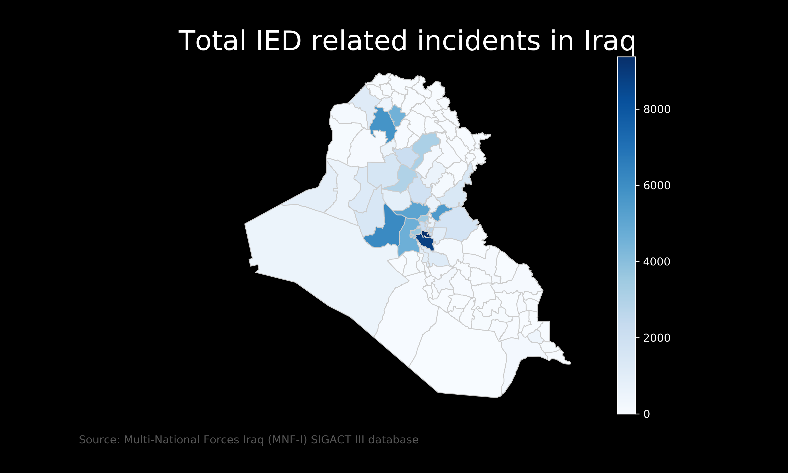
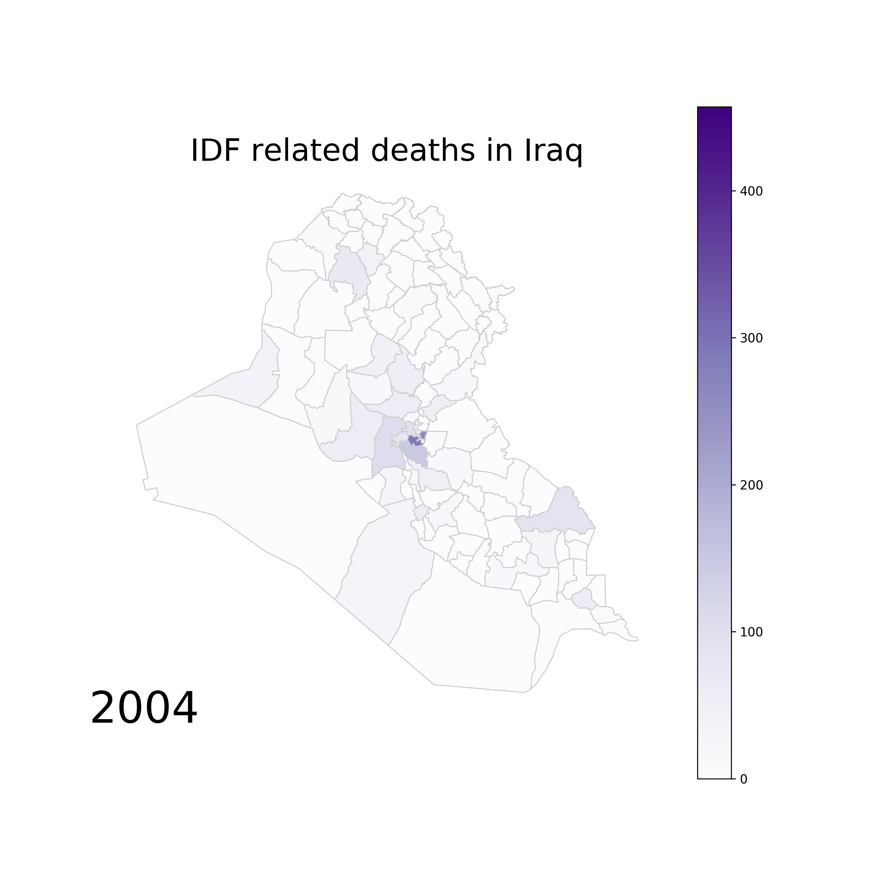

# Replicate Results from The Effect of Civilian Casualties on Wartime Informing: Evidence from the Iraq War

#### Article by Andrew Shaver and Jacob N. Shapiro

[Original Link](https://esoc.princeton.edu/files/effect-civilian-casualties-wartime-informing-evidence-iraq-war)

First project is an attempt to replicate the results and analysis from Andrew Shaver's and Jacob Shapiro's article, The Effect of Civilian Casualties on Wartime Informing. They're using and coding for data from the [Iraq Body Count](https://www.iraqbodycount.org/)database

## Files

### [01data](01data.ipynb)

Loading of data, exploration, rendering of simple maps.

